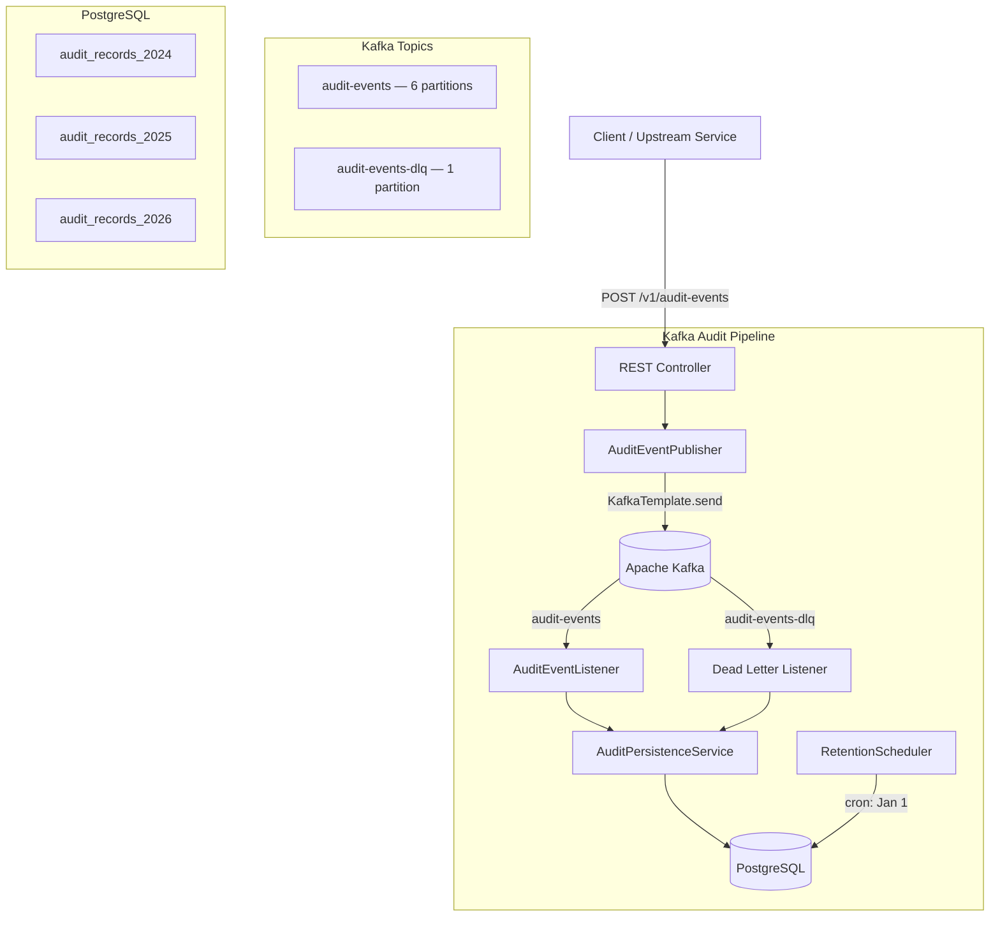
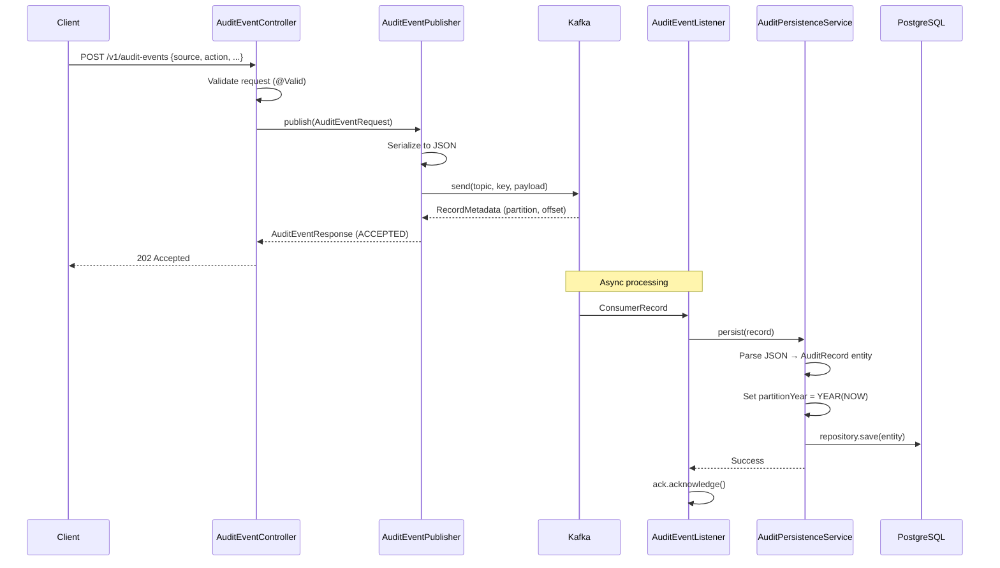
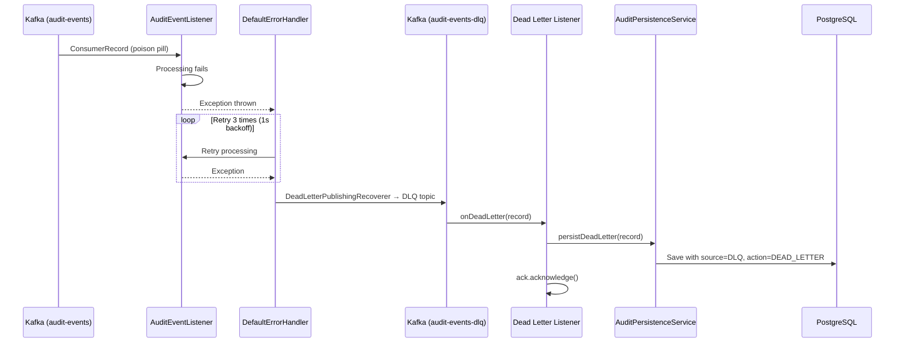
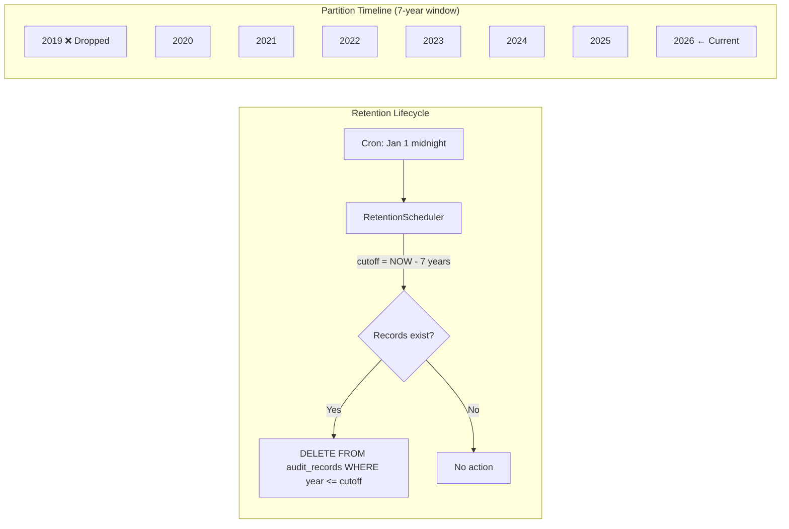
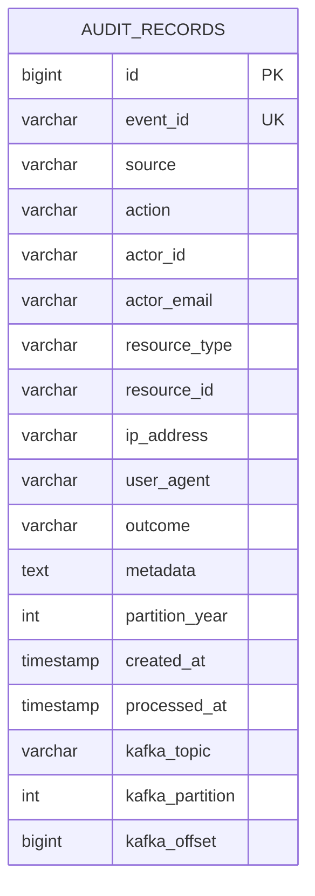

# Architecture

## System Overview

```mermaid
graph TB
    Client[Client / Upstream Service] -->|POST /v1/audit-events| API[REST Controller]

    subgraph "Kafka Audit Pipeline"
        API --> Publisher[AuditEventPublisher]
        Publisher -->|KafkaTemplate.send| Kafka[(Apache Kafka)]

        Kafka -->|audit-events| Listener[AuditEventListener]
        Kafka -->|audit-events-dlq| DLQ[Dead Letter Listener]

        Listener --> PS[AuditPersistenceService]
        DLQ --> PS

        PS --> DB[(PostgreSQL)]

        Scheduler[RetentionScheduler] -->|cron: Jan 1| DB
    end

    subgraph "Kafka Topics"
        T1[audit-events — 6 partitions]
        T2[audit-events-dlq — 1 partition]
    end

    subgraph "PostgreSQL"
        P1[audit_records_2024]
        P2[audit_records_2025]
        P3[audit_records_2026]
    end
```

## Event Publishing Flow

```mermaid
sequenceDiagram
    participant C as Client
    participant AC as AuditEventController
    participant AP as AuditEventPublisher
    participant K as Kafka
    participant AL as AuditEventListener
    participant PS as AuditPersistenceService
    participant DB as PostgreSQL

    C->>AC: POST /v1/audit-events {source, action, ...}
    AC->>AC: Validate request (@Valid)
    AC->>AP: publish(AuditEventRequest)
    AP->>AP: Serialize to JSON
    AP->>K: send(topic, key, payload)
    K-->>AP: RecordMetadata (partition, offset)
    AP-->>AC: AuditEventResponse (ACCEPTED)
    AC-->>C: 202 Accepted

    Note over K,AL: Async processing
    K->>AL: ConsumerRecord
    AL->>PS: persist(record)
    PS->>PS: Parse JSON → AuditRecord entity
    PS->>PS: Set partitionYear = YEAR(NOW)
    PS->>DB: repository.save(entity)
    PS-->>AL: Success
    AL->>AL: ack.acknowledge()
```

## Dead Letter Queue Flow

```mermaid
sequenceDiagram
    participant K as Kafka (audit-events)
    participant AL as AuditEventListener
    participant EH as DefaultErrorHandler
    participant DLQ as Kafka (audit-events-dlq)
    participant DL as Dead Letter Listener
    participant PS as AuditPersistenceService
    participant DB as PostgreSQL

    K->>AL: ConsumerRecord (poison pill)
    AL->>AL: Processing fails
    AL-->>EH: Exception thrown

    loop Retry 3 times (1s backoff)
        EH->>AL: Retry processing
        AL-->>EH: Exception
    end

    EH->>DLQ: DeadLetterPublishingRecoverer → DLQ topic
    DLQ->>DL: onDeadLetter(record)
    DL->>PS: persistDeadLetter(record)
    PS->>DB: Save with source=DLQ, action=DEAD_LETTER
    DL->>DL: ack.acknowledge()
```

## Retention Policy

```mermaid
graph LR
    subgraph "Retention Lifecycle"
        CRON[Cron: Jan 1 midnight] --> RS[RetentionScheduler]
        RS -->|cutoff = NOW - 7 years| CHECK{Records exist?}
        CHECK -->|Yes| DROP[DELETE FROM audit_records WHERE year <= cutoff]
        CHECK -->|No| SKIP[No action]
    end

    subgraph "Partition Timeline (7-year window)"
        Y19[2019 ❌ Dropped]
        Y20[2020]
        Y21[2021]
        Y22[2022]
        Y23[2023]
        Y24[2024]
        Y25[2025]
        Y26[2026 ← Current]
    end
```

## Database Schema

```mermaid
erDiagram
    AUDIT_RECORDS {
        bigint id PK
        varchar event_id UK
        varchar source
        varchar action
        varchar actor_id
        varchar actor_email
        varchar resource_type
        varchar resource_id
        varchar ip_address
        varchar user_agent
        varchar outcome
        text metadata
        int partition_year
        timestamp created_at
        timestamp processed_at
        varchar kafka_topic
        int kafka_partition
        bigint kafka_offset
    }
```
